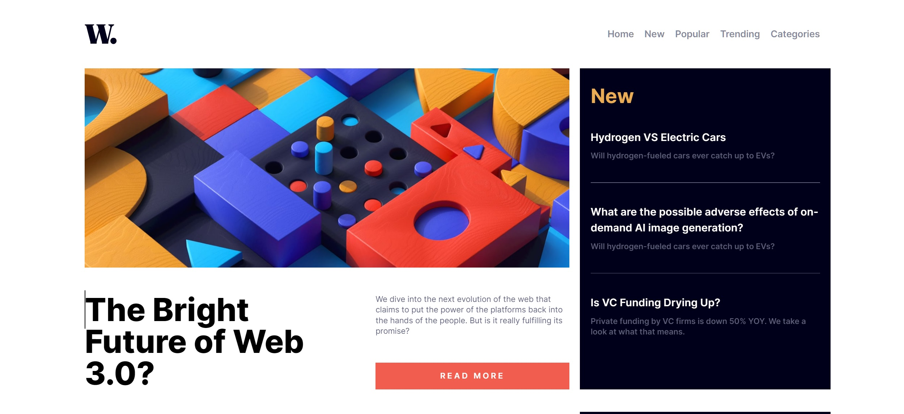
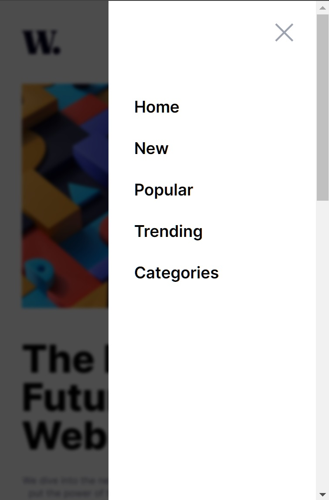

# Frontend Mentor - News homepage solution

This is a solution to the [News homepage challenge on Frontend Mentor](https://www.frontendmentor.io/challenges/news-homepage-H6SWTa1MFl). Frontend Mentor challenges help you improve your coding skills by building realistic projects.

### Links

- Solution URL: [Github - Code source](https://github.com/SdevWeb7/News)
- Live Site URL: [Github - Pages](https://sdevweb7.github.io/News/)

### Built with

- Semantic HTML5 markup
- CSS custom properties
- Flexbox
- TailwindCSS
- [React](https://reactjs.org/) - JS library

## Author

- Website - [SdevWeb7](https://sdevweb.com)
- Frontend Mentor - [@Veustyle](https://www.frontendmentor.io/profile/veustyle)
- Github - [SdevWeb7](https://github.com/SdevWeb7)
- Linkedin - [Steven](https://www.linkedin.com/in/steven-durand-1486b82a1/)
